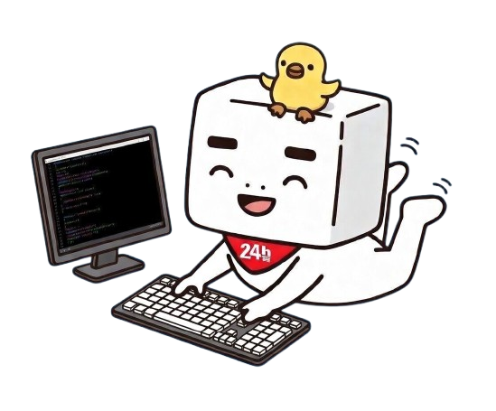

<p align="center">
  
</p>

# pchome-cli

`pchome` 是一個以 Go 撰寫的 PChome 24h CLI，可用來搜尋商品、檢視商品詳情、比較商品，以及取得推薦結果。

CLI 針對兩種使用方式設計：

- 適合人類閱讀的文字輸出，方便瀏覽與決策。
- 適合 AI agent 與程式整合的 `json` / `ndjson` 輸出，並提供穩定的標準化 schema（`v1`）。

預設的人類介面語言為繁體中文（台灣）。如果想改成英文，可在 `~/.pchome/config.toml` 設定 `i18n.language = "en"`。

英文版文件請參考 [README.en.md](./README.en.md)。

## 安裝

```bash
go install github.com/oliy/pchome-cli/cmd/pchome@latest
```

## 快速開始

```bash
# 搜尋商品
go run ./cmd/pchome search "掃地機器人" --min-price 5000 --max-price 15000 --in-stock

# 檢視商品
go run ./cmd/pchome view DRAA5K-A900JOK9O

# 查看推薦
go run ./cmd/pchome recommend DMBL53-A900JDNJS --top 8 --why

# 比較商品
go run ./cmd/pchome compare DRAA5K-A900JOK9O DMBL53-A900JDNJS

# 搜尋詞建議
go run ./cmd/pchome suggest "掃地機"
```

## 指令模型

CLI 採用以任務為中心的指令設計：

- `search QUERY`
- `view PRODUCT`
- `recommend PRODUCT`
- `compare PRODUCT [PRODUCT...]`
- `suggest QUERY`

`PRODUCT` 可以是：

- 原始商品 ID，例如 `DRAA5K-A900JOK9O`
- 帶尾碼的商品 ID，例如 `DRAA5K-A900JOK9O-000`
- 完整的 PChome 商品網址，例如 `https://24h.pchome.com.tw/prod/DRAA5K-A900JOK9O`

## 專案結構

目前的原始碼佈局更接近常見的 Go 開源 CLI 專案：

- `cmd/`: Cobra 指令層與文字輸出邏輯
- `cmd/pchome/`: 真正的 binary entrypoint
- `pkg/catalog/`: 標準化商品模型與聚合 service
- `pkg/config/`: 設定檔讀取與驗證
- `pkg/i18n/`: 介面語言與翻譯字典
- `pkg/output/`: 共用表格輸出
- `pkg/pchome/`: 與 PChome 上游 API 溝通的 client
- `cmd/testdata/`: CLI 幫助文字與輸出 golden fixtures
- `pkg/*/testdata/`: 套件層級的測試 fixtures

## 設定檔

啟動時，`pchome` 會先確認以下檔案是否存在：

```bash
~/.pchome/config.toml
```

如果不存在，CLI 會自動建立完整的預設設定檔。

設定優先順序：

- CLI flags
- `~/.pchome/config.toml`
- 內建預設值

範例：

```toml
version = 1

[http]
timeout = "20s"

[output]
format = "text"
schema_version = "v1"
name_width = 30

[i18n]
language = "zh-TW"

[search]
sort = "relevance"
page_size = 10
limit = 10
show_url = true
columns = []

[recommend]
top = 10
show_url = true
show_why = false
columns = []

[compare]
show_url = true
columns = []

[suggest]
limit = 10

[hermes]
token = ""
```

補充：

- `columns = []` 代表「使用該指令的內建預設欄位順序」。
- 若設定 `columns`，該欄位清單就會成為此指令的預設文字欄位順序。
- `i18n.language` 目前支援 `zh-TW` 與 `en`。
- 設定檔解析器會拒絕未知欄位，避免拼字錯誤被悄悄忽略。

## 輸出模式

### Text

適合人類閱讀的輸出格式。清單型指令會顯示表格，`view` 則會顯示結構化的商品詳情。

### JSON

標準化的機器可讀輸出：

```bash
go run ./cmd/pchome search "掃地機器人" --limit 3 --format json
go run ./cmd/pchome view DRAA5K-A900JOK9O --format json
```

### NDJSON

適合串流或逐行處理的清單輸出：

```bash
go run ./cmd/pchome search "掃地機器人" --limit 5 --format ndjson
go run ./cmd/pchome recommend DMBL53-A900JDNJS --top 5 --format ndjson
```

`ndjson` 支援 `search`、`recommend`、`compare`、`suggest`。

## 搜尋範例

```bash
# 品牌與評價篩選
go run ./cmd/pchome search "掃地機器人" --brand Roborock --min-rating 4.8

# 只看 24h，到貨依價格排序
go run ./cmd/pchome search "掃地機器人" --arrival-24h --sort price-asc

# 自訂文字欄位
go run ./cmd/pchome search "掃地機器人" \
  --columns "#,name,price,rating,reviews,24h,brand,qty,url"
```

## 推薦範例

```bash
# 顯示每個推薦項目的推薦原因
go run ./cmd/pchome recommend DMAB3X-A900EVNNM --top 10 --why
```

## 備註

- 推薦 API 的 token 讀取順序為 `hermes.token` -> `PCHOME_HERMES_TOKEN` -> 內建 fallback token。
- 機器可讀輸出一律維持英文 schema key，避免 locale 變動破壞 agent 整合。
- 目前 schema 版本為 `--schema-version v1`。
- 執行 `go test ./...` 可跑目前的單元測試。
